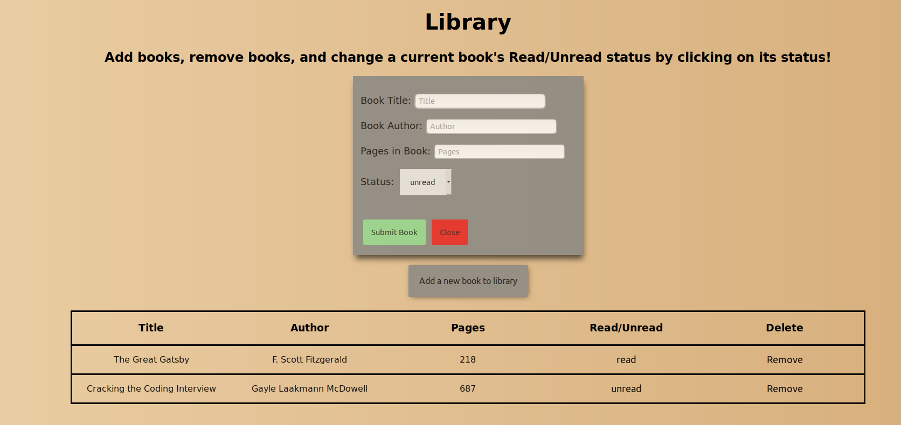

# Library

Demo: https://kennethnguyen.github.io/library/

## Screenshot (As of September 11, 2019)

## Description

A library application where users are able to add a new book, delete a book, and set a book's status if it was read or not

Inspired by The Odin Project's Javascript Course (https://www.theodinproject.com/courses/javascript/lessons/library)

## Utilized

* HTML | Javascript | CSS

## Author

Kenneth Nguyen
